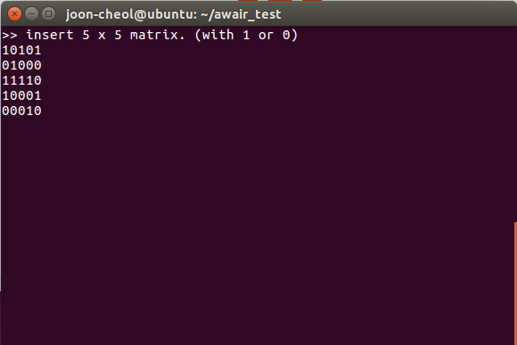
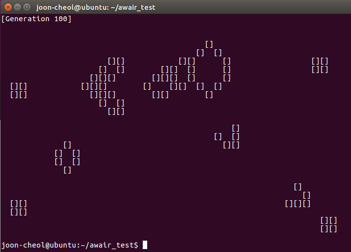

# Game of Life (콘웨이의 생명 게임)

> 주어진 n x m matrix 가 있습니다. 각 cell 에는 세포가 있습니다(총 n * m 개의 cell 이 있겠지요). 
>
> 각 세포는 죽거나 살아있는 상태입니다. 한 주기마다 세포는 다음과 같은 규칙에 따라 상태가 바뀌게됩니다.
>
> - 죽은 세포의 이웃 중 정확히 3개 세포가 살아있으면 그 죽은 세포는 살아나게 됩니다.
>
> - 살아있는 세포의 이웃 중 2개나 3개가 살아있으면 그 세포는 계속 살아있는 상태를 유지합니다.
>
> - 이외의 상황에서는 그 세포는 죽게됩니다.
>
> 이 프로그램은 초기 세포 matrix가 표준 입력으로 주어졌을 때 t 주기 후 세포 matrix 를 화면에 출력합니다.


- 언어는 **C**로 작성하였으며, **bash shell** 상에서 실행되도록하였습니다.

- 입력 형태는 **표준입력**, 출력 형태는 **표준출력** 입니다.

- 프로그램 실행 시 명령행 인자로 **출력할 matrix의 크기**와 **주기 t**를 입력해야합니다.

- 초기 세포 matrix 를 표준입력으로 전달하기 위해서는,

	1. 실행 이후에 matrix를 manual하게 적어주거나
	2. **리디렉션**을 이용하여 초기 세포 matrix가 적힌 파일을 실행 시 전달하면 됩니다. 


자세한 실행 방법은 아래를 참고해 주세요.

*Ubuntu 16.04 LTS에서 vim으로 작성하였습니다. Linux 이외의 환경에서의 동작을 보장하지 않습니다.*


## How to Compile

- bash쉘에서 GoL.c파일을 gcc로 컴파일한다. (실행 파일명을 'GoL'로 지정하는 경우)

```
$ gcc -o GoL GoL.c
```


## How to Execute

- 아래와 같은 명령으로 실행한다. (포함된 map.txt파일을 전달하는 경우)

```
$ ./GoL 25 38 100 < map.txt
```

​	위 명령어는 프로그램으로 25 x 38배열을 전달하고, 100주기 만큼 수행하겠다는 의미이다.
	그리고 리디렉션 문자 ''**<**''를 사용하여 파일의 내용을 표준입력으로 전달한 것이다.

​	실행파일명 뒤의 세개의 인자는 필수적으로 전달되어야한다. (usage:  ./실행파일명 <행> <열> <주기>) 


- 다음과 같이 map 파일 없이도 실행할 수 있다.

```
$ ./GoL 5 5 10
```

​	이 경우, 아래 처럼 실행 이후 직접 5 x 5 배열을 1과 0으로 작성해주어야한다.



​	입력한 배열이 요구하는 크기를 초과하는 경우, 초과된 부분만 무시된다. 덜 입력된 경우, 0으로 채워진다.


- 실행 시 다음과 같은 결과를 확인할 수 있다.



- GoL.c 파일에 define된 **SPEED** 값을 조절하거나, **usleep함수를** 주석처리하면 수행 속도를 조절할 수 있다.

```c
#include<stdio.h>
#include<stdlib.h>
#include<unistd.h>

#define TRUE 1
#define FALSE 0
#define SPEED 50000 //here

/*~~~~~~~in main()~~~~~~~~*/

	while( gen <= t ){
		print_status(cells);
		
		update_generation(cells);
		
		usleep(SPEED); // or here. 
	}

```
---
## Python version via 'pygame'

- its not complete. still ongoing

- to execute in Linux, 
```
$ python GoL.py
```

if the 'No module name' error occurs, type below

```
$ sudo apt-get install python-pygame
```
and after then, retry python GoL.py

- to execute in Window,
	- if you haven't installed python,download Python3 from official (homepage)[https://www.python.org].
	- install 'pygame' library. Follow instructions of this (site)[http://dogdriip.tistory.com/3].
